# Our Program: How It Works and How To Run It

## How To Run Program:

In this blog, we will explain how to download and run our program. After that, we will explain the code in detail. 

First, navigate to the [Solidity IDE](https://remix.ethereum.org). Close out the example program that is loaded by default. 
From here, there are two options on how to run the program. Those options are laid out below.


**Option 1:** 
In that new file put the following two lines. The github URL is https://github.com/benwasserman1/solidity_code/ballot.sol

**Option 2:** 
Open up a new terminal window on Mac or Git Bash on Windows. Then navigate to a directory of your choosing, and run 

```
git clone https://github.com/benwasserman1/solidity_code.git
```

This will copy the appropriate files onto your computer. Return to  the [Solidity IDE](https://remix.ethereum.org), select 
the folder button in the upper left hand corner, and open up ballot.sol. 


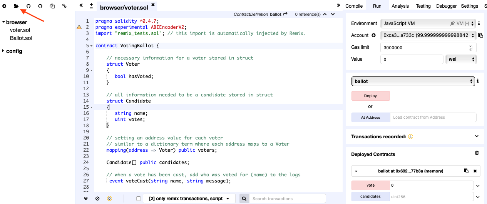


### Choosing the proper compiler

It is important to ensure that you are using the proper compiler. On the drop down menu in the "Compile" tab on the right hand side of the page (shown in screenshot below), click "Select new compiler version." Choose “0.4.25+commit.59dbf8f1” and click “Start compile”. Below is a screenshot of what the compiler looks like within the menu.


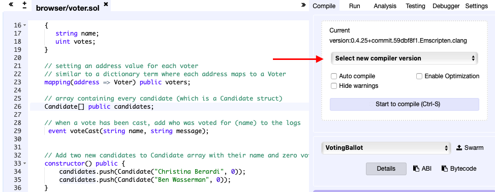


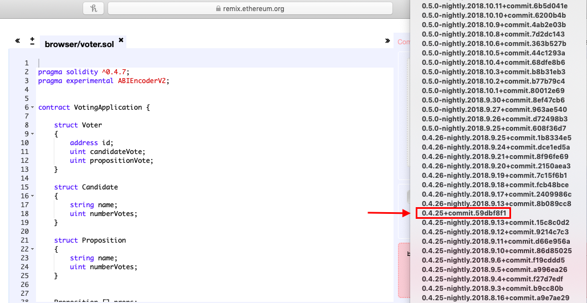


### Deploying the contract

Now switch to the run tab in the upper right hand corner. In this tab there will be an option to deploy the ballot.sol contract.


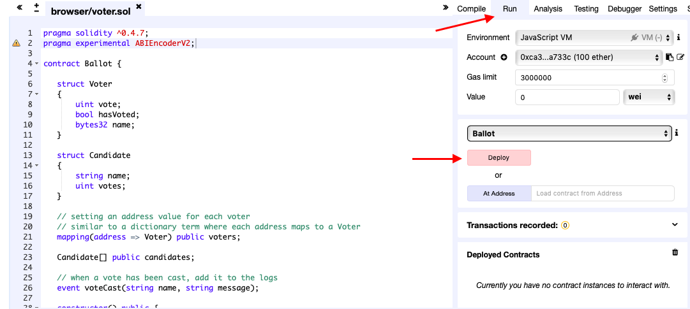


Click “Deploy” and you should see an address along with the title of the contract, “Ballot” pop up underneath the section named “Deployed Contracts.” 


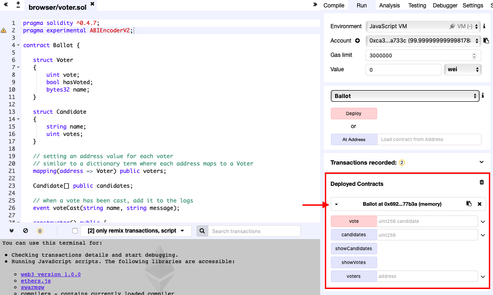


Click on the arrow to the left of the address to expand the section. There will be a few buttons that are interactable. These buttons are the prototype for how we’ve been testing our program. Each button is the implementation of a function. We will go into more detail about what the different colors mean and how the functions work later on. The address that is shown here is the address that on the blockchain that our contract now resides. This is extremely important if we were to truly deploy this contract and turn it into a Dapp. 

For anyone interested in learning about how to turn a Solidity smart contract into a Dapp, this [article](https://medium.com/ethereum-developers/the-ultimate-end-to-end-tutorial-to-create-and-deploy-a-fully-descentralized-dapp-in-ethereum-18f0cf6d7e0e) was extremely helpful for me when I was walking through the steps: 


### Explanation of Code:

Solidity is often confusing at first, so I’m going to walk through our code step by step. Hopefully this helps anyone reading the blog understand the code a little better, and start to work on their own code and deploy their own Dapp! 

To start off, we have a couple pragma directives, which are essentially compiler directives. The first directive specifies the version of the compiler that we are using and the second allows us to use structs in our program. Because the standard ABI encoder does not allow them, it is considered “Experimental.” 

Next, we start to define our contract. A contract in Solidity is a collection of code that sits at a particular address on the blockchain. Within the contract, we start by declaring two structs, Voter and Candidate. The Candidate struct has two member variables: the name of the candidate and the number of votes the candidate has received. The Voter struct has two member variables: an integer for the vote and a boolean to determine if a voter has voted based on their address.

In the next couple lines of code, we implement some important concepts that we covered in a previous blog post. First, we use mapping(address => Voter) public voters. This creates a public variable voters of the mapping type, which allows us to reference a Voter based on his or her address. We also create an array of the Candidate type so that we can store all the candidates that are running or were nominated for the hypothetical position. Lastly, we create an event. This is a functionality within Solidity where you can add information to the logs of the transaction when an important aspect of your program has happened. In our case, we wanted to log every time someone voted and who was voted for. This does not include their name, as this would lead to issues with confidentiality. The directions on how to view items in the log can be found in screenshots below.

Below the text editor is the output of your program. Every time you create a transaction, information about that transaction is stored on the blockchain. This is also where your event output is stored. You can expand on this information by clicking on the arrow circled to the bottom right.

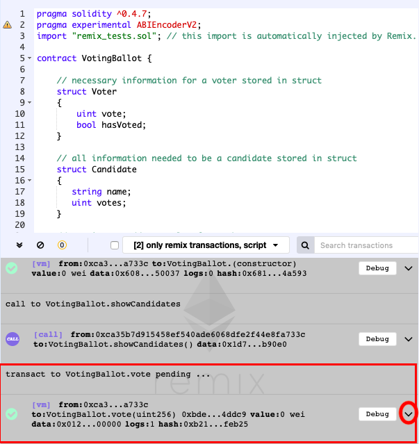

Once expanded, it has all the information from the transaction. What we are looking for is the chunk of text that says "logs."
This is boxed in red.


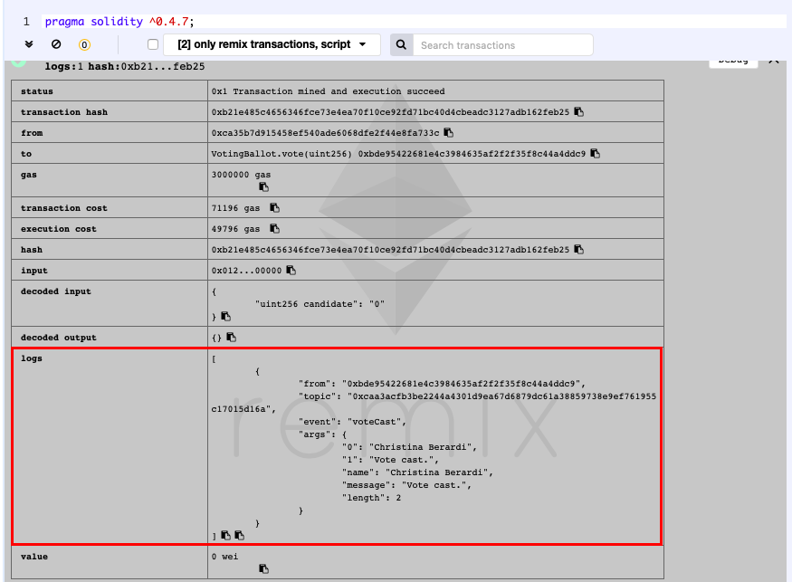


More specifically, we want to see the output from our event. In the logs section, there is an "event" entry, named "voteCast" with a second argument called "args." You can see that this is our same event that's in the code. There will be more information on that in the below section. Further information states that there was a "Vote cast." You can also see the name of who was voted for in the first index.

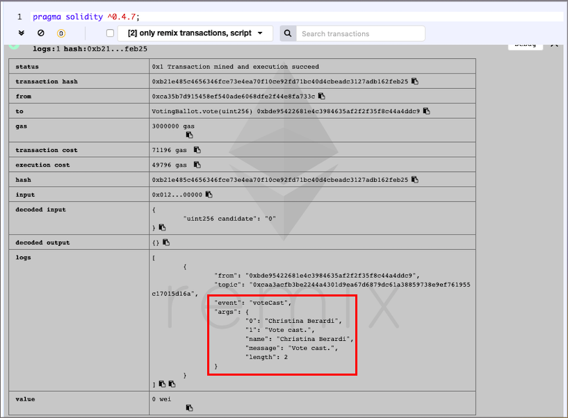


If you try to vote again from that contract, it will not change any of the voting information internally. This is due to our checking that someone doesn’t vote twice. If you want to do it again, then you have to delete that contract, deploy it again, and vote freshly. This will be a completely different transaction that your last one, and information won’t be saved.

The first function is the constructor. In the constructor, we push the names of the candidates to the array and initialize their vote count to 0.

 Next, we have a vote function that doesn’t return anything but takes an integer as input. This integer represents the index in the array for which the voter wants to cast a vote. Within the function, the first line is of particular interest to break down a little further. With the line Voter storage sender = voters[msg.sender], the user has officially “cast” their vote. On the left side of the equal sign, we are creating a new Voter struct for the new vote and saving it in storage, hence the “storage” keyword. We must do this every time someone votes to create a new “ballot” for the “ballot box.” On the right hand side, we are taking the own of the contract (msg.sender), and inputing that into the voters mapping. After that, we merely ensure that the vote is within the bounds of the size of the candidate array. Solidity uses the “require()” function to do this. Require is a function specific to error handling in Solidity, specifically to check conditions on user input. After that, we check to make sure that the person has not previously voted. If they haven’t,

 we mark that the person has voted,
```
sender.hasVoted = true;
```
and increment the candidate’s vote by 1. 
```
candidates[candidate].votes += 1;
```

In the last line, we use emit to add to the logs that every person has voted. If you would like to vote, enter either a 1 or a 0 to the “vote” input box then click on the red “vote” button. This box is indicated by the red arrow below.


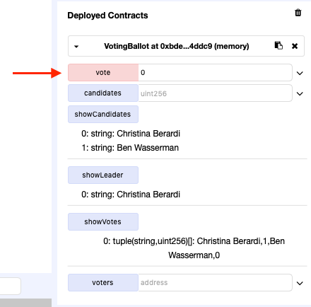


The last couple of functions are relatively simple and do not showcase any Solidity-specific functionality. Nonetheless, we will explain the code.

The showVotes() method takes no input and returns the candidate array. This allows the user to see which candidate has the most votes. The number after the name and comma is the number of votes for that candidate. To run it yourself, click the purple box that says “showCandidates.”


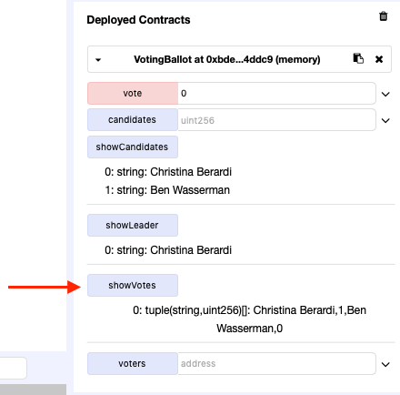


Lastly, the showLeader() function returns the name of the candidate with the most votes. It does this by looping through the candidate array and comparing the number of votes to a “maxVotes” variable. Every time there was a vote larger than the current max, the current winner was changed to them. The name of the person with the most votes at the end is then returned for the user to see.


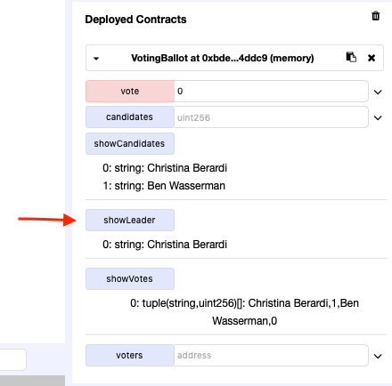


