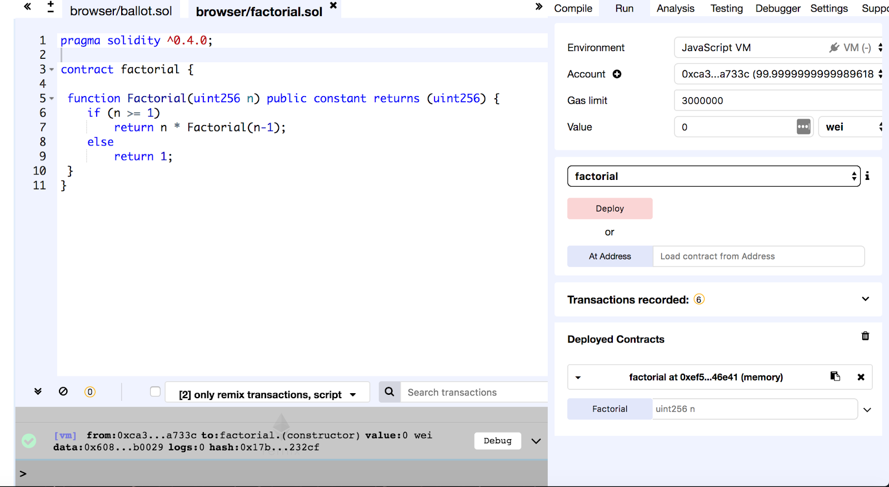

# Termination in Solidity

Our while loop implements a factorial function. This function is finitely branching, which is another property of termination,
because it cannot branch, or get called, more than n times. An ARS if terminating when it’s finitely branching and has a 
measure function. In this case, the measure function is n, even though the value of the factorial is increasing. Every 
step, n decreases by (n-1).  Therefore, ϕ(a)>ϕ(b). 

The code below shows recursion in Solidity with the classic factorial example. We have a contract titled Recursion which 
has the function Factorial. This function return values of type uint256. The Factorial function merely implements the recursive definition of a factorial, with an integer input for the factorial that we want to calculate. Essentially, each time this is run, a contract is deployed and functions can be run within that contract on the EVM. In this case, we have the Factorial function. Below there is a screen capture of what the program looks like when deployed in the Remix IDE. When an integer is input into the UI text box that says uint256 n and then the Factorial button is clicked, the output is returned. 





```
pragma solidity ^0.4.0;
 
contract Recursion {
 
 function Factorial(uint256 n) public constant returns (uint256) {
    if (n >= 1)
        return n * Factorial(n-1);
    else
        return 1;
 }
 ```
